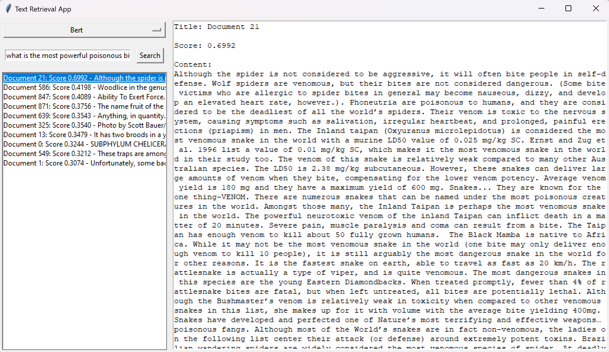
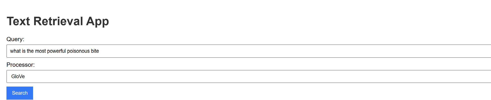
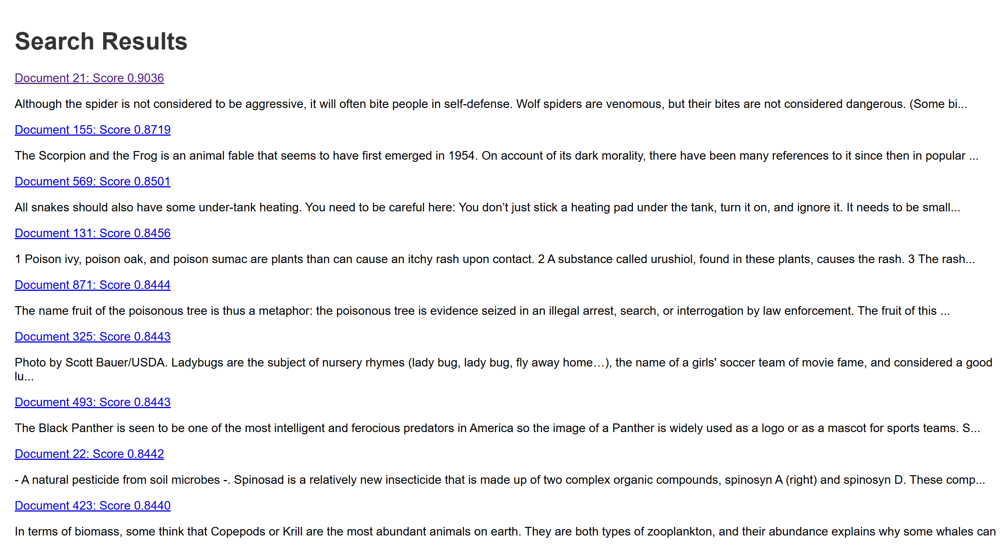
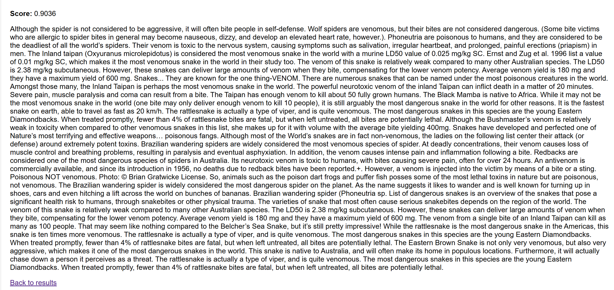

# Mini-Text-Retrieval-App
This mini project simulates how Google works. When a query is entered, the app will return documents related to the query that was inputted. 
The dataset used for this project is MS_Marco v1.1.

## 1.Setup
```
 pip install -r requirements.txt
```
## 2.Prepare Pretrain Glove
Download the GloVe Embedding from [here](https://drive.google.com/file/d/12l40qeIi5zioX2WaVBLXD_oarc8zbaqG/view)
 
## 3. Run app
```
python main.py
```
Here is the interface of the app, which includes a model selection bar (BoW, GloVe, and BERT), a search bar, a box containing the top results, and the document content.



## 4. Run web app
```
python web_app.py
```

The interface is similar to the desktop app. Users enter a query and select an embedding model. The next page will display the top related documents along with their accuracy scores. When a document is clicked, the entire document will be shown.





## 5. Conclusion
- The BoW model is quite simple to implement. The results when searching for documents related to the query often show a low similarity score between the query and the documents. However, the top 1 document is usually accurately the one corresponding to the query in the dataset.
- The pre-trained GloVe model provides better accuracy in searches compared to the basic BoW model. The issue with this model is that the similarity scores between the query and the top documents, from the second document onwards, are still quite high, nearly equal to the top 1 document. This is not ideal for this dataset because each query corresponds to one document in the dataset.
- The BERT model gives the best results, with the top 1 document having the highest similarity score. The documents from the second onward generally have a much lower similarity score between the documents and the query.